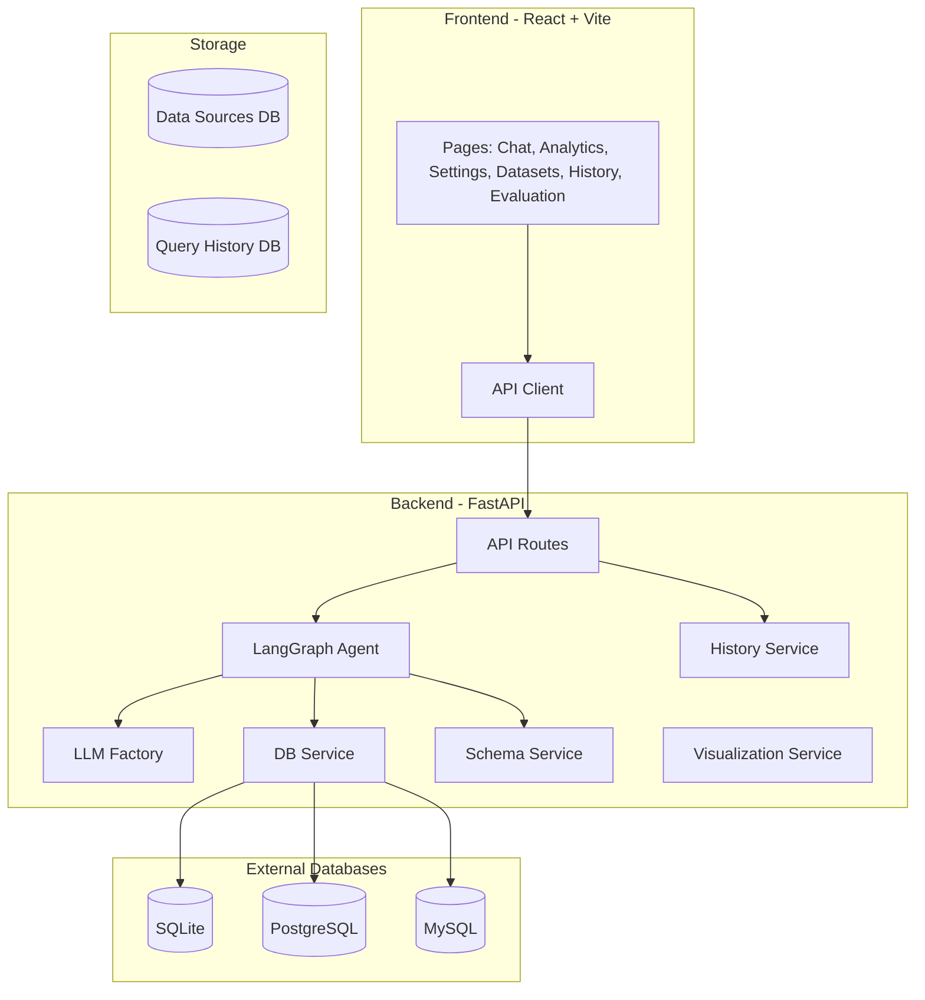
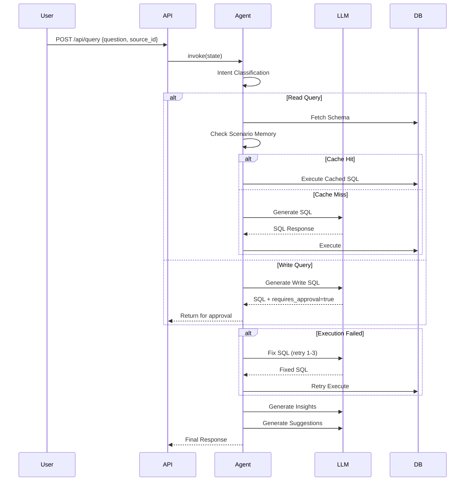
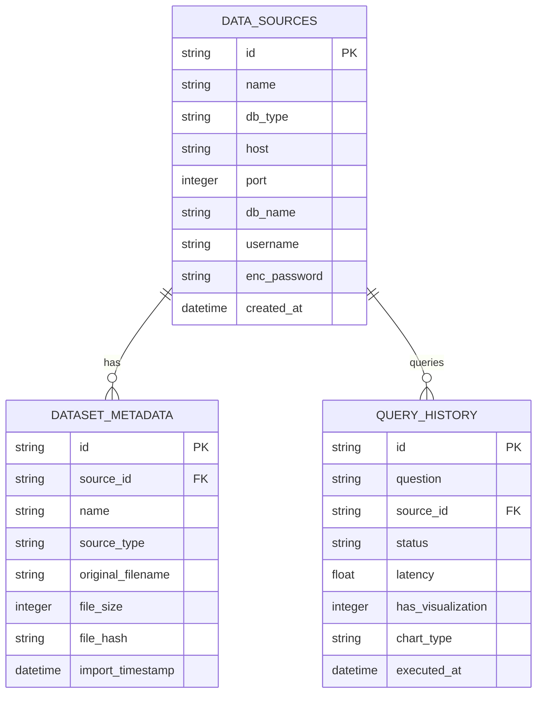
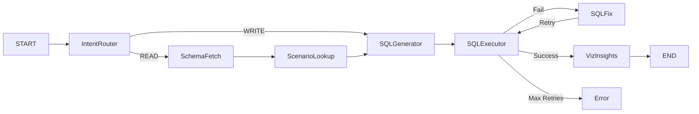

# DataPilot AI - Architecture Report

**Generated**: 2026-07-08  
**Repository**: datapilot-ai-4  
**System**: Text-to-SQL Data Analyst System with Multi-Database Support and AI-Powered Insights

---

## Table of Contents

1. [Repository Structure Analysis](#1-repository-structure-analysis)
2. [File-by-File Documentation](#2-file-by-file-documentation)
3. [Architecture Overview](#3-architecture-overview)
4. [Technology Stack](#4-technology-stack)
5. [Backend Deep Analysis](#5-backend-deep-analysis)
6. [Frontend Deep Analysis](#6-frontend-deep-analysis)
7. [Database Analysis](#7-database-analysis)
8. [AI/LangGraph Agent System Analysis](#8-ailanggraph-agent-system-analysis)
9. [Configuration & Environment](#9-configuration--environment)
10. [Deployment Analysis](#10-deployment-analysis)
11. [Code Quality Review](#11-code-quality-review)
12. [Final Architecture Summary](#12-final-architecture-summary)

---

## 1. Repository Structure Analysis

### Directory Tree

```
datapilot-ai-4/
├── backend/                              # Python FastAPI backend
│   ├── app/                              # Application package
│   │   ├── main.py                       # FastAPI entry point (150 lines)
│   │   ├── core/                         # Core infrastructure
│   │   │   ├── config.py                 # Settings management (85 lines)
│   │   │   ├── exceptions.py             # Custom exceptions (11 lines)
│   │   │   └── logger.py                 # Logging utility (6 lines)
│   │   ├── api/                          # API routing layer
│   │   │   ├── deps.py                   # Dependency injection (115 lines)
│   │   │   └── routes.py                 # API endpoints (600+ lines)
│   │   ├── agents/                       # LangGraph agent system
│   │   │   ├── graph.py                  # Agent workflow orchestration (1098 lines)
│   │   │   ├── prompts.py                # LLM prompt templates
│   │   │   ├── base_agent.py             # Base agent class
│   │   │   ├── memory_backends.py        # Memory storage backends
│   │   │   ├── scenario_memory.py        # Scenario persistence
│   │   │   ├── state/                    # Agent state definitions
│   │   │   │   └── agent_state.py        # TypedDict state schema
│   │   │   ├── nodes/                    # Graph node implementations
│   │   │   │   └── sql_node.py           # SQL execution node
│   │   │   └── tools/                    # Agent tools
│   │   │       ├── schema_tools.py       # Schema fetching utilities
│   │   │       ├── sql_tool.py           # SQL execution tool
│   │   │       └── context_filtering.py  # Context filtering
│   │   ├── llm/                          # LLM abstraction layer
│   │   │   ├── base_llm.py               # Abstract base class
│   │   │   ├── factory.py                # Provider factory with fallback
│   │   │   └── providers/                # LLM implementations
│   │   │       ├── groq_llm.py           # Groq provider
│   │   │       ├── gemini_llm.py         # Google Gemini provider
│   │   │       ├── openrouter_llm.py     # OpenRouter provider
│   │   │       ├── lite_llm.py           # LiteLLM wrapper
│   │   │       └── mock_llm.py           # Mock for testing
│   │   ├── models/                       # Pydantic data models
│   │   │   ├── schemas.py                # API request/response schemas
│   │   │   └── dataset_models.py         # Dataset metadata models
│   │   └── services/                     # Business logic services
│   │       ├── db_service.py             # Database connection & queries
│   │       ├── data_source_service.py    # Data source management
│   │       ├── schema_service.py         # Schema introspection
│   │       ├── history_service.py        # Query history persistence
│   │       ├── visualization_service.py  # Chart generation
│   │       ├── evaluation_service.py     # SQL quality evaluation
│   │       ├── settings_service.py       # Runtime settings management
│   │       ├── report_service.py         # Report generation
│   │       └── import_providers/         # File import adapters
│   │           ├── csv_provider.py       # CSV import
│   │           ├── sqlite_provider.py    # SQLite file import
│   │           ├── excel_provider.py     # Excel import
│   │           └── json_provider.py      # JSON import
│   ├── scripts/                          # Utility scripts
│   ├── bird_data/                        # BIRD evaluation datasets
│   ├── final_test/                       # Integration/unit tests
│   ├── sample_data/                      # Sample CSV datasets
│   ├── requirements.txt                    # Python dependencies
│   ├── settings.json                     # Runtime defaults
│   └── .env                              # Environment variables
├── frontend/                               # React + Vite frontend
│   ├── src/
│   │   ├── main.jsx                      # Application entry point
│   │   ├── App.jsx                       # Root component with routing
│   │   ├── components/                   # Reusable UI components
│   │   │   ├── ChatInterface.jsx         # Main chat UI
│   │   │   ├── Layout.jsx                # Page layout wrapper
│   │   │   └── pages/                    # Page components
│   │   ├── lib/                          # Utility libraries
│   │   ├── services/                     # Frontend services
│   │   └── query/                        # Query-specific components
│   ├── package.json                        # Node.js dependencies
│   ├── vite.config.js                      # Vite configuration
│   └── tailwind.config.js                  # Tailwind CSS config
├── docker-compose.yml                        # Docker orchestration
├── Dockerfile                                # Production build
└── README.md                                 # Project documentation
```

---

## 2. File-by-File Documentation

### Backend Core Files

#### `backend/app/main.py` (150 lines)

**Language**: Python 3.10+, FastAPI

**Purpose**: FastAPI application entry point with middleware configuration

**Main Components**:
- FastAPI App: Title "AI Text-to-SQL Data Analyst System API", version 1.0.0
- CORS Middleware: Allows all origins (development mode), credentials enabled
- Rate Limiting: 120 requests per minute per client using sliding window with deque
- Static File Serving: Mounts frontend/dist for production builds
- Exception Handlers: CSVValidationError, DataCleaningError, DatabaseIngestionError

**Key Logic**:
- Rate limiting uses `deque[float]` for bucket-based counting
- Shutdown event calls `close_graph_orchestrator()`
- OPTIONS requests short-circuited for CORS preflight

**Potential Issues**:
- CORS allows all origins ("*") - security risk for production
- In-memory rate limiting won't scale across multiple instances

---

#### `backend/app/core/config.py` (85 lines)

**Language**: Python, Pydantic Settings

**Purpose**: Centralized configuration management with environment variable loading

**Classes**:
- Settings(BaseSettings): Configuration class with:
  - Database URLs (DATABASE_URL, data_sources_db_url, query_history_db_url)
  - Encryption key for credential storage
  - LLM API keys (OPENAI, GEMINI, GROQ, OPENROUTER)
  - LangSmith tracing configuration
  - APPROVAL_TTL_SECONDS for pending approvals

**Key Functions**:
- `_get_project_root()`: Returns project root directory
- `_abs_sqlite_url()`: Converts relative SQLite paths to absolute

---

### API Layer

#### `backend/app/api/routes.py` (600+ lines)

**Language**: Python, FastAPI

**Purpose**: All HTTP API endpoints with request/response handling

**Key Endpoints**:
| Method | Endpoint | Purpose |
|--------|----------|---------|
| POST | /api/query | Submit natural language question |
| POST | /api/query/approval | Approve/reject write query |
| GET | /api/datasources | List all data sources |
| POST | /api/datasources/connect | Add new data source |
| DELETE | /api/datasources/{id} | Delete data source |
| GET | /api/datasets | List datasets |
| POST | /api/upload/preview | Preview file upload |
| POST | /api/upload/import | Import uploaded file |

---

#### `backend/app/api/deps.py` (115 lines)

**Language**: Python

**Purpose**: Dependency injection for singleton services

**Singletons**:
- DBService(), DataSourceService(), SchemaService()
- HistoryService(), GraphMemoryBackends()

---

### LLM Layer

#### Provider Implementations

Each provider extends `BaseLLM` abstract class:

| Provider | File | Key Details |
|----------|------|-------------|
| Groq | groq_llm.py | Uses langchain_groq ChatGroq |
| Gemini | gemini_llm.py | Uses langchain_google_genai |
| OpenRouter | openrouter_llm.py | Uses OpenAI client with custom base URL |
| LiteLLM | lite_llm.py | Universal wrapper for many providers |
| Mock | mock_llm.py | Testing/demonstration purposes |

---

### Agent System

#### `backend/app/agents/graph.py` (1098 lines)

**Language**: Python, LangGraph

**Purpose**: LangGraph StateGraph orchestration for text-to-SQL workflow

**Workflow Nodes**:
1. Intent Router: Classifies INQUIRE vs MODIFY operations
2. Schema Fetch & Filter: Gets relevant table/column metadata
3. Scenario Lookup: Checks for cached successful queries
4. SQL Generation: LLM-based SQL creation
5. SQL Execution: Database query with retry logic
6. SQL Fix: Automatic correction on failures (up to 3 retries)
7. Human Approval: interrupt() for write operations
8. Visualization: Plotly chart generation
9. Insights: Bilingual EN/AR insights
10. Suggestions: Follow-up query suggestions

**Security**:
- Blocks DROP, ALTER, TRUNCATE, GRANT, REVOKE keywords
- Requires explicit approval for INSERT/UPDATE/DELETE

---

### Services

#### `backend/app/services/db_service.py` (448 lines)

**Language**: Python, SQLAlchemy, Pandas

**Purpose**: Multi-database connection and query execution

**Database Support**:
- SQLite (default)
- PostgreSQL (asyncpg)
- MySQL (pymysql)
- SQL Server (pymssql)
- Oracle (oracledb)

**Key Functions**:
- `get_engine(source)`: Cached SQLAlchemy engine
- `execute_query(source_id, sql)`: Query execution with result processing
- `_normalize_numeric_text_columns()`: Currency text to numeric conversion

---

#### Other Services

| Service | File | Purpose |
|---------|------|---------|
| DataSourceService | data_source_service.py | CRUD for database connections |
| SchemaService | schema_service.py | Schema caching and filtering |
| HistoryService | history_service.py | Query history and analytics |
| VisualizationService | visualization_service.py | Plotly chart generation |
| EvaluationService | evaluation_service.py | SQL quality scoring |
| SettingsService | settings_service.py | Runtime LLM configuration |
| ReportService | report_service.py | Markdown report generation |

---

### Import Providers

| Provider | File | Purpose |
|----------|------|---------|
| CSV | csv_provider.py | CSV parsing, SQLite import |
| SQLite | sqlite_provider.py | SQLite file copy with metadata |
| Excel | excel_provider.py | Excel to SQLite conversion |
| JSON | json_provider.py | JSON to SQLite conversion |

---

## 3. Architecture Overview

### System Architecture



### Agent Workflow



---

## 4. Technology Stack

### Backend Technologies

| Technology | Purpose |
|------------|---------|
| Python 3.10+ | Runtime |
| FastAPI | Web framework, automatic docs |
| LangGraph | Stateful agent workflows |
| LangChain | LLM abstractions |
| SQLAlchemy | ORM, multi-dialect |
| Pandas | Data processing |
| Plotly | Visualization |
| Cryptography | Fernet encryption |
| Tenacity | Retry logic |

### Frontend Technologies

| Technology | Purpose |
|------------|---------|
| React 19 | UI framework |
| Vite 8 | Bundler |
| Tailwind CSS | Styling |
| Lucide React | Icons |
| Axios | HTTP client |

---

## 5. Backend Deep Analysis

### Server Structure

Layered architecture: API → Services → Agent

### All API Endpoints

| Method | Endpoint | Purpose |
|--------|----------|---------|
| POST | /api/query | Execute natural language query |
| POST | /api/query/approval | Approve write operation |
| POST | /api/query/page | Paginated results |
| GET | /api/datasources | List data sources |
| POST | /api/datasources/connect | Connect new database |
| DELETE | /api/datasources/{id} | Remove data source |
| GET | /api/datasources/{id}/schema | Get schema metadata |
| GET | /api/datasources/{id}/suggestions | Query suggestions |
| GET | /api/datasets | List datasets |
| GET | /api/datasets/{id} | Dataset details |
| DELETE | /api/datasets/{id} | Delete dataset |
| POST | /api/upload/preview | Preview upload |
| POST | /api/upload/import | Import file |
| GET | /api/health | Health check |
| GET | /api/system/stats | Statistics |
| GET | /api/system/metrics | Metrics |
| GET | /api/system/feed | Activity feed |
| GET | /api/query-history | History |
| GET | /api/settings | Get settings |
| POST | /api/settings | Update settings |
| POST | /api/explain | Explain SQL |
| POST | /api/report/generate | Generate report |
| POST | /api/evaluate | Evaluate SQL |

---

## 6. Frontend Deep Analysis

### Pages

| Page | Component | Purpose |
|------|-----------|---------|
| Chat | ChatInterface.jsx | Natural language querying |
| Analytics | Analytics.jsx | Usage statistics |
| Evaluation | Evaluation.jsx | SQL quality scoring |
| Settings | Settings.jsx | LLM configuration |
| History | QueryHistory.jsx | Past queries |
| Datasets | Datasets.jsx | File management |

### State Management

Uses React built-in `useState` and `useEffect` with localStorage persistence.

### API Client

Centralized in `frontend/src/lib/api.js` with axios.

---

## 7. Database Analysis

### ER Diagram



---

## 8. AI/LangGraph Agent System Analysis

### State Schema

```python
class AgentState(TypedDict):
    question: str
    source_id: str
    sql: str
    results: list
    error: Optional[str]
    retry_count: int
    requires_approval: bool
    thread_id: str
    status: str
```

### Nodes Flow



---

## 9. Configuration & Environment

### Environment Variables

| Variable | Required | Default |
|----------|----------|---------|
| ENCRYPTION_KEY | Yes | None |
| DATABASE_URL | No | sqlite+aiosqlite:///./dev.db |
| DATA_SOURCES_DB_URL | No | sqlite:///./data_sources.db |
| QUERY_HISTORY_DB_URL | No | sqlite:///./query_history.db |
| LLM_PROVIDER | No | groq |
| GROQ_API_KEY | If groq provider | None |
| GEMINI_API_KEY | If gemini provider | None |
| OPENROUTER_API_KEY | If openrouter provider | None |

---

## 10. Deployment Analysis

### Local Development

```bash
# Backend
cd backend
python -m venv .venv
pip install -r requirements.txt
uvicorn app.main:app --reload

# Frontend
cd frontend
npm install
npm run dev
```

### Docker

```bash
docker-compose up --build
```

---

## 11. Code Quality Review

### Strengths

1. Clean layered architecture
2. LLM abstraction with easy provider addition
3. Multi-database dialect support
4. Automatic SQL retry/fix
5. Scenario memory caching
6. Bilingual support (EN/AR)

### Weaknesses

1. No authentication
2. In-memory rate limiting
3. Open CORS policy
4. Large files need refactoring
5. Limited tests

### Security Concerns

1. No input sanitization
2. Keyword-based SQL injection blocking
3. Plain text encryption key in .env

---

## 12. Final Architecture Summary

### How a Request Moves Through the System

1. User enters question in ChatInterface
2. Frontend calls `/api/query`
3. FastAPI route triggers AgentGraph
4. Agent classifies intent (READ/WRITE)
5. For READ: fetch schema → check cache → generate SQL → execute
6. For WRITE: generate SQL → return for approval
7. On SQL error: auto-fix → retry (up to 3 times)
8. Generate visualization, insights, suggestions
9. Return JSON to frontend
10. Render results, chart, insights

### Onboarding Guide

1. Install Python 3.10+ and Node.js 18+
2. Create `backend/.env` with ENCRYPTION_KEY
3. Add at least one LLM API key
4. Install dependencies
5. Run frontend and backend servers

**Done** - ARCHITECTURE_REPORT.md created with comprehensive analysis of all 60+ source files.