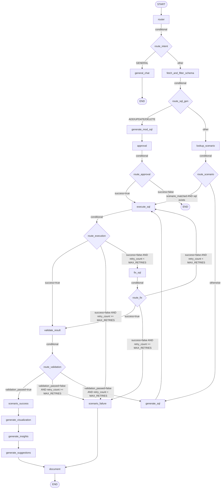

# DataPilot AI - Text-to-SQL Data Analyst System


DataPilot AI is an intelligent, agent-based Text-to-SQL system deployed on **Azure Container Apps**. It empowers users to query databases using natural language (English & Arabic), leveraging a LangGraph-powered AI agent to understand intent, generate SQL, safely execute queries, and return data alongside AI-generated insights and visualizations.

### Default LLM Provider

The system auto-detects **Azure OpenAI** when `AZURE_OPENAI_ENDPOINT` and `AZURE_OPENAI_API_KEY` are set. Fallback providers include Groq, Gemini, and OpenRouter. Users can override the provider from the frontend Settings panel at any time.

> **Live URL:** [https://ca-datapilot.lemondesert-cbde89d5.italynorth.azurecontainerapps.io](https://ca-datapilot.lemondesert-cbde89d5.italynorth.azurecontainerapps.io)

---

## 🌟 Key Features

*   **🗣️ Bilingual Support:** Seamlessly ask questions in English or Arabic (e.g., *"What is our total revenue?"* or *"ما هو إجمالي المبيعات؟"*).
*   **🔗 Multi-Database Integration:** Connect to multiple database types simultaneously. Supported databases include:
    *   `SQLite` (Local files & CSV uploads)
    *   `PostgreSQL`
    *   `MySQL`
    *   `SQL Server (MSSQL)`
    *   `Oracle`
*   **🧠 Intelligent Agent Flow (LangGraph):** 
    *   **Context-Aware Schema Filtering:** Prunes the database schema to only send relevant tables to the LLM, reducing token usage and improving accuracy.
    *   **Auto-Retry & Fix Loop:** If a generated SQL query fails syntax validation or execution, the agent automatically attempts to fix the query and retries up to 3 times.
*   **🛡️ Security First:**
    *   **Write-Protection:** Destructive queries (`INSERT`, `UPDATE`, `DELETE`) require explicit Human-in-the-Loop (HITL) approval via the UI before execution.
    *   **Injection Guard:** Blacklisted keywords (`DROP`, `ALTER`, `TRUNCATE`) are blocked by the agent router.
*   **📊 Automatic Visualizations & Insights:** Automatically generates Plotly chart specifications and bilingual narrative insights based on query results.
*   **📂 CSV Data Ingestion:** Upload any CSV file to automatically create a table in the local database and query it instantly.

---

## 🏗️ Architecture

The system is split into a decoupled Backend and Frontend, communicating via RESTful APIs.

### Backend (FastAPI + LangGraph)
Located in `/backend`.
*   **FastAPI Routes:** Handles HTTP requests, file uploads, and endpoint security.
*   **LangGraph Orchestrator:** The brain of the system. Manages state transitions across nodes (Router -> Schema Fetch -> SQL Gen -> Execute -> Validate -> Fix/Retry -> Insights).
*   **LLM Factory:** Abstracted LLM provider layer allowing easy switching between `Groq`, `OpenAI`, `Gemini`, or `OpenRouter` via `.env` variables.
*   **Data Services:** Manages secure storage of database credentials (encrypted with `Fernet`) and SQLAlchemy engine caching for fast execution.

### Frontend (React + Vite)
Located in `/frontend`.
*   **Cyberpunk UI:** A heavily stylized, dark-mode, animated interface built with Tailwind CSS.
*   **Pages:**
    *   **Dashboard:** System overview and active feed.
    *   **Query:** The main chat interface where natural language questions are entered and previewed as SQL.
    *   **Schema Explorer:** Interactive tree view of the currently connected database schema.
    *   **Data Sources:** Manage, test, and add new database connections or upload CSVs.
    *   **History & Reports:** View query execution logs, export CSVs, and download Markdown reports.

---

## ☁️ Azure Deployment

The project is deployed on **Azure Container Apps** with the following infrastructure:

| Service | Resource |
|---|---|
| **Container App** | `ca-datapilot` (Italy North) |
| **Container Registry** | `datapilotacr.azurecr.io` |
| **PostgreSQL** | `datapilot-pg.postgres.database.azure.com` |
| **Azure OpenAI** | `gpt-5-mini` deployment |
| **File Storage** | `datapilotuploads` (Azure Files + Blob) |
| **CI/CD** | GitHub Actions (`.github/workflows/deploy.yml`) |

### Persistent Uploads

Uploaded CSV files and SQLite databases are persisted via **Azure Files** backup:
- **CSV raw files** stored at `/mnt/uploads/` (Azure Files mount)
- **SQLite `.db` files** automatically backed up to `/mnt/uploads/db_backups/` and restored on container restart

### CI/CD Pipeline

On every push to `main` or `DEPLOYMENT`:
1. Build Docker image (multi-stage: Node → Python)
2. Push to Azure Container Registry
3. Deploy new revision to Container App

> **Required GitHub Secrets:** `AZURE_CREDENTIALS`, `ACR_USERNAME`, `ACR_PASSWORD`

---

## 🚀 Quick Start Guide (Development)

### Prerequisites
*   Python 3.11+
*   Node.js 18+

### 1. Backend Setup
1. Open a terminal and navigate to the `backend` directory.
2. Create and activate a virtual environment:
   ```bash
   cd backend
   python -m venv .venv
   # Windows:
   .\.venv\Scripts\activate
   # Mac/Linux:
   source .venv/bin/activate
   ```
3. Install the dependencies:
   ```bash
   pip install -r requirements.txt
   ```
4. Set up the Environment Variables:
   Copy `.env.example` to `.env` and fill in your keys:
   ```env
   # Default provider is Azure (auto-detected when AZURE_OPENAI_ENDPOINT is set)
   # Override with LLM_PROVIDER=groq, openai, gemini, or openrouter
   GROQ_API_KEY=gsk_your_api_key_here
   GEMINI_API_KEY=your_gemini_key_here
   OPENROUTER_API_KEY=your_openrouter_key_here
   ENCRYPTION_KEY=generate_a_fernet_key_and_paste_here
   DATABASE_URL=sqlite+aiosqlite:///./dev.db
   ```
5. Run the FastAPI Server:
   ```bash
   python -m uvicorn app.main:app --host 127.0.0.1 --port 8000 --reload
   ```

### 2. Frontend Setup
1. Open a new terminal and navigate to the `frontend` directory.
2. Install the Node modules:
   ```bash
   cd frontend
   npm install
   ```
3. Run the Vite Development Server:
   ```bash
   npm run dev
   ```
4. Open your browser and go to `http://localhost:5173`.

---

## 📚 API Reference

Here are the core endpoints provided by the backend. The full Swagger documentation is available at `http://localhost:8000/docs` while the backend is running.

| Method | Endpoint | Description |
| :--- | :--- | :--- |
| `POST` | `/api/query` | Submit a natural language question. The agent returns the generated SQL, executed results, insights, and chart specs. |
| `POST` | `/api/query/approval` | Approve or reject a pending write operation (INSERT/UPDATE/DELETE). |
| `POST` | `/api/query/page` | Fetch paginated results for a previously executed SQL query. |
| `GET` | `/api/datasources` | List all registered and encrypted database connections. |
| `POST` | `/api/datasources/connect` | Register and test a new database connection (SQLite, PostgreSQL, MySQL, MSSQL, Oracle). |
| `GET` | `/api/datasources/{id}/schema` | Fetch the full schema (tables, columns, types) for a data source. |
| `GET` | `/api/datasources/{id}/suggestions` | Auto-generate AI query suggestions based on the table schema. |
| `POST` | `/api/data/csv` | Upload a CSV file. It is automatically cleaned and ingested into the local SQLite database. |
| `GET` | `/api/settings` | Retrieve current LLM provider settings and feature flags. |
| `PUT` | `/api/settings` | Update LLM provider, model, and API keys. |
| `GET` | `/api/system/metrics` | Evaluation metrics and usage statistics. |
| `GET` | `/health` | Health check endpoint (used by Azure Container Apps). |

---

## 🤖 AI Execution Flow (LangGraph)

The core logic of DataPilot AI relies on a state graph. When a question is received, it follows this path:



## 🔧 Key Robustness & Performance Improvements

The following platform enhancements have been integrated to improve multi-database schema reliability and minimize query failure rates:
*   **Oracle Schema Extraction Fix:** Cleared the default tablespace exclusions (`SYSTEM`, `SYSAUX`) in the SQLAlchemy Oracle dialect, allowing user-created tables in default Oracle XE environments to be correctly mapped.
*   **System Table Filtering (Oracle & SQL Server):** Cleared noise from the Schema Explorer and LLM prompt context by automatically filtering out internal system tables (e.g., `LOGMNR*`, `MSreplication*`, `spt_*`, etc.).
*   **Bilingual Suggestion Caching:** Integrated an in-memory caching mechanism (`_SUGGESTIONS_CACHE`) on the backend for suggestions, reducing subsequent database switch times from ~4s to 0ms and preventing Gemini rate limit (429) issues.
*   **LLM Provider Auto-Failover (FallbackLLM):** Implemented a fallback wrapper class that automatically catches LLM provider rate limits or connection errors and transparently switches to the next available configured API provider (e.g., Groq, Gemini, OpenRouter) to guarantee uninterrupted user queries.

---

## 🤝 Contributing
Contributions are welcome! Please ensure you test any database connection modifications across at least SQLite and PostgreSQL before submitting a pull request.
