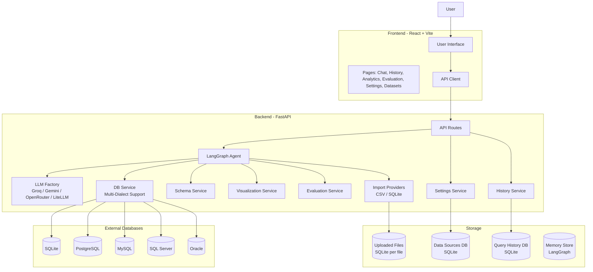
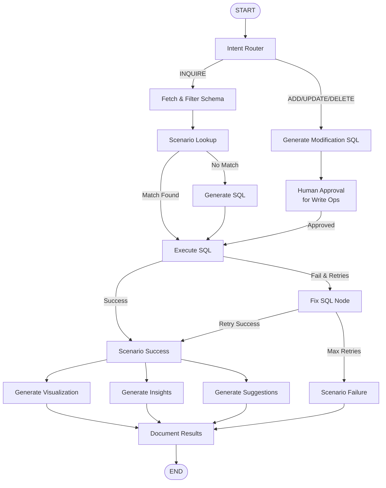

# DataPilot AI

A Text-to-SQL Data Analyst System that enables natural language querying of databases with multi-database support, AI-powered insights, and automatic visualizations.

## Project Overview

DataPilot AI bridges the gap between natural language and database queries, allowing users to ask questions in English or Arabic and receive SQL execution results, insights, and visualizations. The system uses a LangGraph-powered agent architecture to understand intent, generate SQL, and handle complex query workflows with automatic retry and fix mechanisms.

**Problem Solved:** Traditional database querying requires technical SQL knowledge. DataPilot AI democratizes data access by allowing non-technical users to query databases conversationally.

**Target Users:**
- Data analysts seeking rapid query prototyping
- Business users needing ad-hoc data insights
- Developers building data-driven applications
- Arabic-speaking users requiring bilingual query support

## Architecture



### Agent Flow

When a query is submitted, the LangGraph agent orchestrates the following workflow:



## Features

- **Bilingual Natural Language Queries**: English and Arabic support with automatic translation to SQL
- **Multi-Database Connectivity**: SQLite, PostgreSQL, MySQL, SQL Server, and Oracle
- **LLM Provider Abstraction**: Switch between Groq, Gemini, OpenRouter, or LiteLLM providers
- **Automatic Query Execution**: Generated SQL executed against connected database
- **Auto-Retry & SQL Fix**: Failed queries automatically analyzed and fixed up to 3 retries
- **Human-in-the-Loop Approval**: Destructive operations (INSERT, UPDATE, DELETE) require explicit approval
- **SQL Injection Protection**: Blacklisted keywords (DROP, ALTER, TRUNCATE) blocked programmatically
- **Automatic Visualizations**: Plotly charts generated based on query results
- **Bilingual Insights**: AI-generated insights in both English and Arabic
- **Scenario Memory**: Learns from past successes and failures to improve future queries
- **Query History**: Persistent history with performance metrics and visualization tracking
- **CSV/SQLite Import**: Upload and query CSV or SQLite database files directly
- **Settings Management**: Runtime configuration of LLM provider, model, temperature, and API keys
- **SQL Evaluation**: Quality scoring for generated queries (syntax, correctness, completeness, efficiency)
- **Report Generation**: Markdown reports from query results
- **Rate Limiting**: 120 requests per minute per client

## Technology Stack

| Technology | Version/Tool | Purpose |
|------------|--------------|---------|
| Python | 3.10+ | Backend runtime |
| FastAPI | Latest | Web framework and API |
| LangGraph | Latest | Agent orchestration and state management |
| LangChain | Latest | LLM integration framework |
| React | 19.x | Frontend UI framework |
| Vite | 8.x | Frontend build tool |
| Tailwind CSS | 3.x | Styling framework |
| SQLAlchemy | Latest | Database ORM (sync/async) |
| SQLite | 3 | Default/local database storage |
| PostgreSQL | - | External database support |
| MySQL | - | External database support |
| Plotly | Latest | Visualization library |
| Pandas | Latest | Data processing |
| Cryptography | - | Password encryption (Fernet) |
| Tenacity | - | Retry logic |

## Project Structure

```
datapilot-ai-4/
├── backend/
│   ├── app/
│   │   ├── main.py              # FastAPI application entry point
│   │   ├── core/
│   │   │   ├── config.py        # Settings and environment configuration
│   │   │   ├── exceptions.py    # Custom exception definitions
│   │   │   └── logger.py        # Logging configuration
│   │   ├── api/
│   │   │   ├── routes.py        # All API endpoints
│   │   │   └── deps.py          # Dependency injection (services, orchestrator)
│   │   ├── agents/
│   │   │   ├── graph.py         # LangGraph agent workflow definition
│   │   │   ├── prompts.py       # LLM prompt templates
│   │   │   ├── nodes/           # Agent node implementations
│   │   │   ├── state/           # Agent state definition
│   │   │   ├── tools/           # Agent tools (schema, SQL execution)
│   │   │   └── scenario_memory.py
│   │   ├── llm/
│   │   │   ├── base_llm.py      # LLM abstract interface
│   │   │   ├── factory.py       # LLM provider factory with fallback
│   │   │   └── providers/       # Groq, Gemini, OpenRouter, LiteLLM implementations
│   │   ├── models/
│   │   │   └── schemas.py       # Pydantic models for API
│   │   └── services/
│   │       ├── db_service.py        # Database connection and query execution
│   │       ├── data_source_service.py # Data source management
│   │       ├── history_service.py     # Query history persistence
│   │       ├── schema_service.py      # Schema introspection
│   │       ├── visualization_service.py # Chart generation
│   │       ├── evaluation_service.py  # SQL quality evaluation
│   │       ├── settings_service.py    # Runtime settings management
│   │       ├── report_service.py      # Report generation
│   │       └── import_providers/      # CSV/SQLite import framework
│   ├── requirements.txt         # Python dependencies
│   ├── settings.json            # Default LLM settings
│   └── .env                     # Environment variables (create from template)
├── frontend/
│   ├── src/
│   │   ├── App.jsx              # Root component with routing
│   │   ├── main.jsx             # Application entry
│   │   ├── components/          # Reusable UI components
│   │   │   ├── ChatInterface.jsx
│   │   │   ├── Layout.jsx
│   │   │   ├── ResultVisualizer.jsx
│   │   │   └── pages/
│   │   │       ├── Analytics.jsx
│   │   │       ├── Evaluation.jsx
│   │   │       ├── QueryHistory.jsx
│   │   │       ├── Datasets.jsx
│   │   │       └── Settings.jsx
│   │   ├── lib/                 # Utilities and API client
│   │   └── services/            # Frontend service modules
│   ├── package.json             # Node.js dependencies
│   ├── vite.config.js           # Vite configuration
│   └── tailwind.config.js       # Tailwind CSS configuration
├── docker-compose.yml           # Docker orchestration
├── Dockerfile                   # Multi-stage build for production
└── README.md                    # This documentation
```

## Installation & Setup

### Prerequisites

- Python 3.10 or higher
- Node.js 18 or higher
- pip (Python package manager)
- npm (Node package manager)

### Backend Setup

```bash
# Navigate to backend directory
cd backend

# Create virtual environment
python -m venv .venv

# Activate virtual environment
# Windows:
.\.venv\Scripts\activate
# macOS/Linux:
source .venv/bin/activate

# Install dependencies
pip install -r requirements.txt

# Create .env file with required configuration
cp settings.json settings_template.json  # Reference for required keys
```

### Environment Variables

Create a `.env` file in the `backend/` directory:

```env
# Database URLs (SQLite by default, no setup required)
DATABASE_URL=sqlite+aiosqlite:///./dev.db
DATA_SOURCES_DB_URL=sqlite:///./data_sources.db
QUERY_HISTORY_DB_URL=sqlite:///./query_history.db

# LLM Provider (groq, gemini, openrouter, litellm)
LLM_PROVIDER=groq

# API Keys - at least one required
GROQ_API_KEY=your_groq_api_key_here
GEMINI_API_KEY=your_gemini_api_key_here
OPENROUTER_API_KEY=your_openrouter_api_key_here

# Encryption key for stored credentials (generate with: python -c "from cryptography.fernet import Fernet; print(Fernet.generate_key().decode())")
ENCRYPTION_KEY=your_32_byte_fernet_key_here

# Optional: LangSmith tracing
LANGCHAIN_TRACING_V2=true
LANGCHAIN_API_KEY=your_langsmith_api_key
```

### Frontend Setup

```bash
# Navigate to frontend directory
cd frontend

# Install dependencies
npm install

# Run development server
npm run dev
```

### Running the Application

```bash
# Terminal 1: Start backend
cd backend
uvicorn app.main:app --host 127.0.0.1 --port 8000 --reload

# Terminal 2: Start frontend
cd frontend
npm run dev

# Access the application
# Frontend: http://localhost:5173
# API Docs: http://localhost:8000/docs
```

### Docker Setup (Production)

```bash
# From project root
docker-compose up --build

# Services available at:
# Frontend: http://localhost:5173
# Backend: http://localhost:8000
```

## Configuration

### Environment Variables (.env)

| Variable | Required | Description |
|----------|----------|-------------|
| `DATABASE_URL` | No | Main database connection (defaults to SQLite) |
| `DATA_SOURCES_DB_URL` | No | Connection for storing data source credentials |
| `QUERY_HISTORY_DB_URL` | No | Connection for query history |
| `LLM_PROVIDER` | No | Default LLM provider (groq, gemini, openrouter, litellm) |
| `GROQ_API_KEY` | Conditional | API key for Groq LLM |
| `GEMINI_API_KEY` | Conditional | API key for Google Gemini |
| `OPENROUTER_API_KEY` | Conditional | API key for OpenRouter |
| `ENCRYPTION_KEY` | Yes | Fernet key for encrypting stored passwords |
| `LANGCHAIN_TRACING_V2` | No | Enable LangSmith tracing (true/false) |
| `LANGCHAIN_API_KEY` | No | LangSmith API key for evaluation |
| `APPROVAL_TTL_SECONDS` | No | TTL for pending approvals (default: 3600) |

### Settings (settings.json)

Located in `backend/settings.json` - runtime-configurable without restart:

```json
{
  "llm_provider": "groq",
  "model": "llama-3.3-70b-versatile",
  "temperature": 0.2,
  "max_tokens": 2048,
  "api_keys": {
    "groq": "",
    "openrouter": "",
    "gemini": "",
    "openai": ""
  },
  "visualization": {
    "default_chart_type": "auto",
    "max_bars": 20,
    "theme": "dark"
  },
  "features": {
    "scenario_memory": true,
    "arabic_column_rewrite": true,
    "context_filtering": true,
    "auto_visualization": true,
    "human_approval_write": true
  }
}
```

## Usage Guide

### 1. Connect a Data Source

1. Launch the application and open the right panel
2. Navigate to the "Data Nodes" tab
3. Fill in connection details:
   - **SQLite**: Provide file path for database
   - **PostgreSQL/MySQL**: Host, port, database name, username, password
   - **SQL Server**: Host, port (1433), database, username, password
   - **Oracle**: Host, port (1521), service name

### 2. Upload Data (Optional)

1. Go to the "Datasets" page
2. Click "Upload Dataset"
3. Select a CSV or SQLite database file
4. Preview and confirm import
5. The data becomes immediately queryable

### 3. Ask Questions

Type natural language questions in the chat interface:
- English: "What is the total revenue by month?"
- Arabic: "ما هو إجمالي المبيعات؟"
- Filtering: "Show employees with salary above 80000"
- Aggregation: "Count orders by status"

### 4. Manage Write Operations

For INSERT/UPDATE/DELETE queries:
1. Submit the query
2. Review the generated SQL in the approval prompt
3. Click "Approve & Execute" or "Deny"
4. Results appear after successful execution

### 5. View Analytics

Navigate to the "Analytics" page to see:
- Query success rates
- Average latency
- Visualization usage trends
- Chart type distribution

## API Documentation

### Query Endpoint

| Method | Endpoint | Description |
|--------|----------|-------------|
| `POST` | `/api/query` | Submit natural language question |
| `POST` | `/api/query/approval` | Approve or reject write query |
| `POST` | `/api/query/page` | Get paginated query results |

**POST /api/query**
```json
{
  "question": "Show total sales by month",
  "source_id": "uuid-of-data-source",
  "thread_id": "optional-thread-uuid",
  "preview_only": false,
  "sql": null,
  "provider": "optional-override",
  "model": "optional-override",
  "temperature": 0.2
}
```

**Response:**
```json
{
  "sql": "SELECT strftime('%Y-%m', order_date) as month, SUM(amount) FROM orders GROUP BY month",
  "results": [...],
  "visualization": {...},
  "insights": [{"ar": "...", "en": "..."}],
  "suggestions": [{"ar": "...", "en": "..."}],
  "requires_approval": false,
  "thread_id": "..."
}
```

### Data Sources

| Method | Endpoint | Description |
|--------|----------|-------------|
| `GET` | `/api/datasources` | List all data sources |
| `POST` | `/api/datasources/connect` | Connect new data source |
| `DELETE` | `/api/datasources/{id}` | Delete data source |
| `GET` | `/api/datasources/{id}/schema` | Get schema for source |
| `GET` | `/api/datasources/{id}/suggestions` | Get query suggestions |

### Datasets

| Method | Endpoint | Description |
|--------|----------|-------------|
| `GET` | `/api/datasets` | List all datasets |
| `GET` | `/api/datasets/{id}` | Get dataset details |
| `DELETE` | `/api/datasets/{id}` | Delete dataset |

### Import

| Method | Endpoint | Description |
|--------|----------|-------------|
| `POST` | `/api/upload/preview` | Preview CSV/SQLite upload |
| `POST` | `/api/upload/import` | Import uploaded file |
| `POST` | `/api/data/csv` | Legacy CSV upload endpoint |

### System

| Method | Endpoint | Description |
|--------|----------|-------------|
| `GET` | `/api/health` | Health check |
| `GET` | `/api/system/stats` | System statistics |
| `GET` | `/api/system/metrics` | Analytics metrics |
| `GET` | `/api/system/feed` | Activity feed |
| `GET` | `/api/query-history` | Query history |

### Settings

| Method | Endpoint | Description |
|--------|----------|-------------|
| `GET` | `/api/settings` | Get current settings |
| `POST` | `/api/settings` | Update settings |

### Utilities

| Method | Endpoint | Description |
|--------|----------|-------------|
| `POST` | `/api/explain` | Explain SQL query |
| `POST` | `/api/report/generate` | Generate markdown report |
| `POST` | `/api/evaluate` | Evaluate query quality |

## Database

### Registry Database Schema

**data_sources** table:
- `id` (String, PK) - UUID identifier
- `name` (String) - User-friendly name
- `db_type` (String) - sqlite/postgresql/mysql/mssql/oracle
- `host` (String) - Database host
- `port` (Integer) - Database port
- `db_name` (String) - Database name/path
- `username` (String) - Connection username
- `enc_password` (String) - Encrypted password
- `created_at` (DateTime) - Creation timestamp

**dataset_metadata** table:
- `id` (String, PK) - UUID
- `source_id` (String, FK) - References data_sources
- `name` (String) - Dataset name
- `source_type` (String) - csv/sqlite
- `original_filename` (String) - Original uploaded file
- `file_size` (Integer) - File size in bytes
- `file_hash` (String) - SHA-256 hash for deduplication
- `import_timestamp` (DateTime) - Import date
- `table_count` (Integer) - Number of tables
- `total_row_count` (Integer) - Total rows across tables
- `column_count` (Integer) - Total columns
- `tables_json` (Text) - Table metadata JSON
- `relationships_json` (Text) - Foreign key relationships
- `quality_report_json` (Text) - Data quality metrics

**query_history** table:
- `id` (String, PK) - UUID
- `question` (String) - Original question
- `source_id` (String) - Data source used
- `status` (String) - SUCCESS/ERROR
- `latency` (Float) - Execution time in seconds
- `has_visualization` (Integer) - Whether chart was generated
- `chart_type` (String) - Bar/line/pie/etc.
- `executed_at` (DateTime) - Execution timestamp

## Deployment

### Production Build

```bash
# Frontend build
cd frontend
npm run build

# Backend Docker image
docker-compose -f docker-compose.yml up --build -d
```

### Environment Configuration for Production

```env
# Use PostgreSQL for persistent storage
DATABASE_URL=postgresql+asyncpg://user:pass@db:5432/datapilot
DATA_SOURCES_DB_URL=postgresql://user:pass@db:5432/datapilot
QUERY_HISTORY_DB_URL=postgresql://user:pass@db:5432/datapilot

# Required API key for production
GROQ_API_KEY=your_production_key
ENCRYPTION_KEY=your_production_fernet_key

# Disable debug mode
DEBUG=false
```

### Docker Compose (docker-compose.yml)

Two services are defined:
- **backend**: FastAPI server on port 8000
- **frontend-dev**: Vite development server on port 5173

For production, use the multi-stage Dockerfile which builds the frontend and serves static files from FastAPI.

## Development Guide

### Project Scripts

```bash
# Backend - run from backend/
uvicorn app.main:app --reload          # Development server
python -m pytest                       # Run tests
python app/agents/graph.py             # CLI test mode

# Frontend - run from frontend/
npm run dev                            # Development server
npm run build                          # Production build
npm run lint                           # Linting
npm run preview                        # Preview production build
```

### Testing

```bash
# Run all tests
cd backend
python -m pytest

# Test CLI mode
python app/agents/graph.py
# Then choose CSV or Database and enter a query
```

### Code Style

- **Python**: Use type hints, async when possible, Pydantic for validation
- **JavaScript**: Modern ES6+, React hooks, Tailwind for styling
- **Naming**: snake_case for backend, camelCase for frontend
- **Imports**: Group by standard library, third-party, local

### Adding a New LLM Provider

1. Create `backend/app/llm/providers/{provider}_llm.py`:

```python
from app.llm.base_llm import BaseLLM

class NewProviderLLM(BaseLLM):
    def __init__(self, api_key: str):
        self.api_key = api_key

    def generate(self, prompt: str, system_message: str = None, max_tokens: int = None) -> str:
        # Implementation here
        pass
```

2. Register in `backend/app/llm/factory.py`:
   - Add to `VALID_PROVIDERS` set
   - Add import and instantiation in `get_llm()`

3. Add API key field in `backend/settings.json` and `settings_service.py`

## Future Improvements

- [ ] **Snowflake Support**: Add Snowflake database connector
- [ ] **BigQuery Integration**: Google BigQuery support
- [ ] **MongoDB Provider**: NoSQL database support
- [ ] **Advanced Visualizations**: Support for multi-series, forecasting charts
- [ ] **Query Optimization Suggestions**: AI suggestions for faster queries
- [ ] **Data Export Formats**: Excel, JSON, Parquet export
- [ ] **Query Scheduling**: Run queries on recurring schedules
- [ ] **Multi-user Support**: User accounts and permission system
- [ ] **Query Versioning**: Track and rollback SQL changes
- [ ] **Improved Arabic NLP**: Better Arabic query parsing with specialized models

## License

This project is provided as-is for educational and development purposes. See individual component licenses for third-party dependencies.